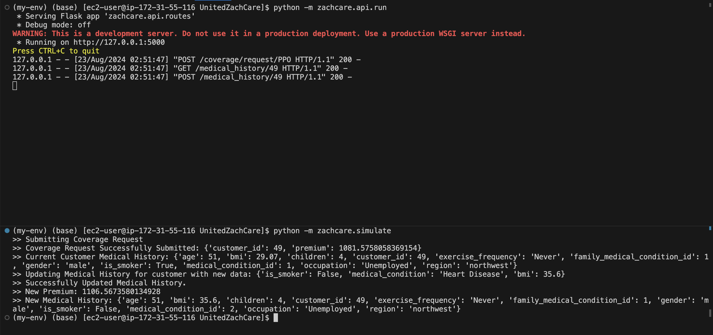

# UnitedZachCare

Cloud-native health insurance platform that calculates risk-adjusted premiums from customer medical data using a trained ML model, backed by a RESTful API, relational database, and object storage on AWS.

## Architecture

| Component | Technology | Purpose |
|-----------|-----------|---------|
| API | Flask on EC2 | REST endpoints for coverage submission and medical history updates |
| Database | Amazon RDS (PostgreSQL) | Persistent storage for customers, policies, and medical records |
| ORM | SQLAlchemy | Data modeling and migrations (`zachcare.db`) |
| ML Model | scikit-learn (Linear Regression) | Premium prediction based on medical history (`zachcare.ml`) |
| Storage | Amazon S3 | Static asset and model artifact storage |

## API

**`POST /coverage/submit`** — Submit a new coverage request

Accepts a JSON payload of medical data. Creates `Customer`, `PolicyInstance`, `MedicalHistory`, and `MedicalCondition` records, then runs the premium prediction model and sets the calculated premium on the policy.

**`POST /medical_history/<customer_id>`** — Update medical history

Accepts updated medical data for an existing customer. Updates the medical history record and recalculates the premium.

Routes are defined in `zachcare.api.routes`.

## ML Model

The premium prediction model is a linear regression trained on the [Kaggle Insurance Charges](https://www.kaggle.com/datasets/mirichoi0218/insurance) dataset. It is invoked at coverage submission and on any medical history update to keep premiums current.

Implementation: `zachcare.ml.insurance_model`

## Running the Simulation

`simulate.py` demonstrates the full workflow end-to-end — submitting a coverage request, then updating the customer's medical data — and prints the API responses at each step.

## Roadmap

- Incorporate simulated claims data pipeline
- Evaluate online-learning models for incremental retraining
- Tighten database constraints and add input validation
