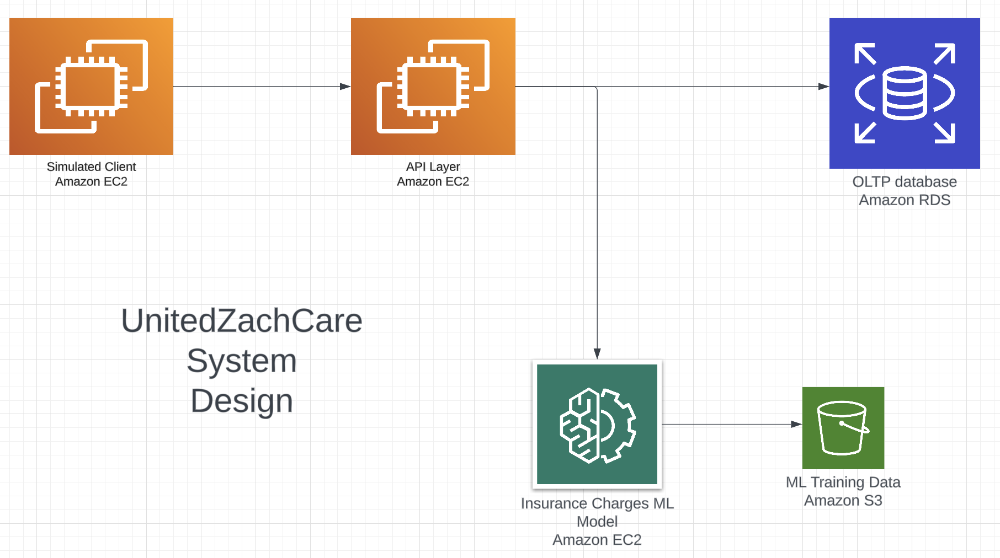

*Selected project from NYU Graduate Database Systems (CSCI-GA.2433)*

# UnitedZachCare

Cloud-native health insurance platform that calculates risk-adjusted premiums from customer medical data using a trained ML model, backed by a RESTful API, relational database, and object storage on AWS.

## System Design



## Architecture

| Layer | Technology | Role |
|-------|-----------|------|
| API | Flask / EC2 | REST endpoints for coverage and medical history |
| Database | Amazon RDS (PostgreSQL) | Customers, policies, and medical records |
| ML | scikit-learn | Premium prediction via linear regression |
| Storage | Amazon S3 | Model artifacts and static assets |

## API Reference

| Endpoint | Method | Description |
|----------|--------|-------------|
| `/coverage/submit` | POST | Creates customer, policy, and medical records; returns a model-predicted premium |
| `/medical_history/<customer_id>` | POST | Updates medical history and recalculates the premium |

Routes: `zachcare.api.routes`

## ML Model

Linear regression trained on the [Kaggle Insurance Charges](https://www.kaggle.com/datasets/mirichoi0218/insurance) dataset. Invoked on every coverage submission and medical history update to keep premiums current.

Implementation: `zachcare.ml.insurance_model`

## Quick Start

```bash
python simulate.py
```

Runs the full workflow end-to-end: submits a coverage request, updates the customer's medical data, and prints API responses at each step.
